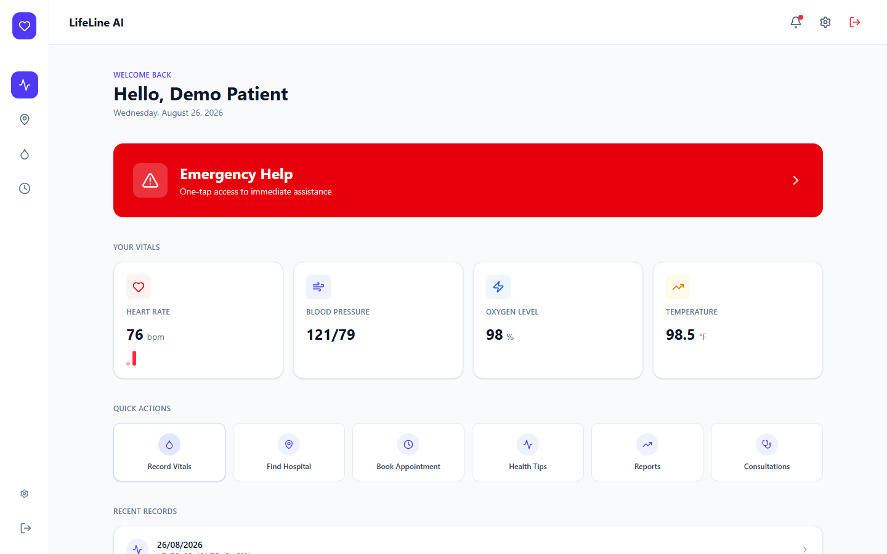
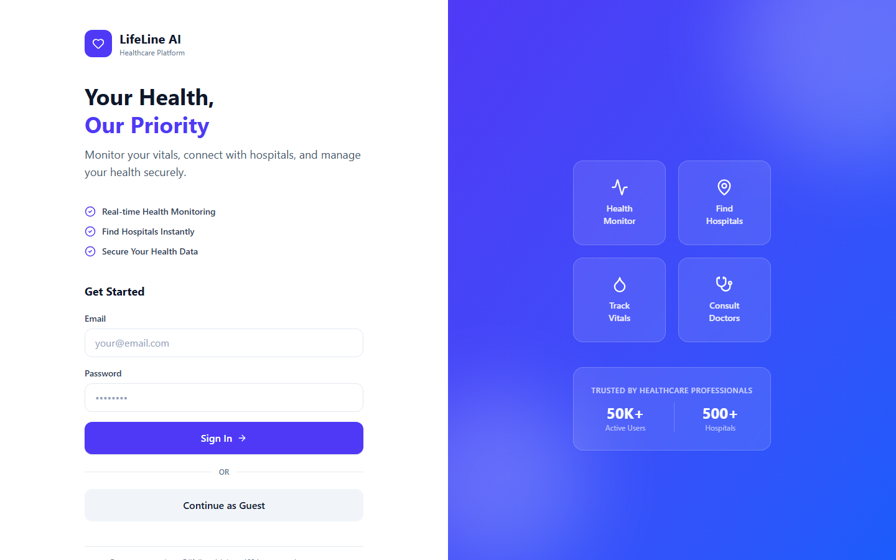
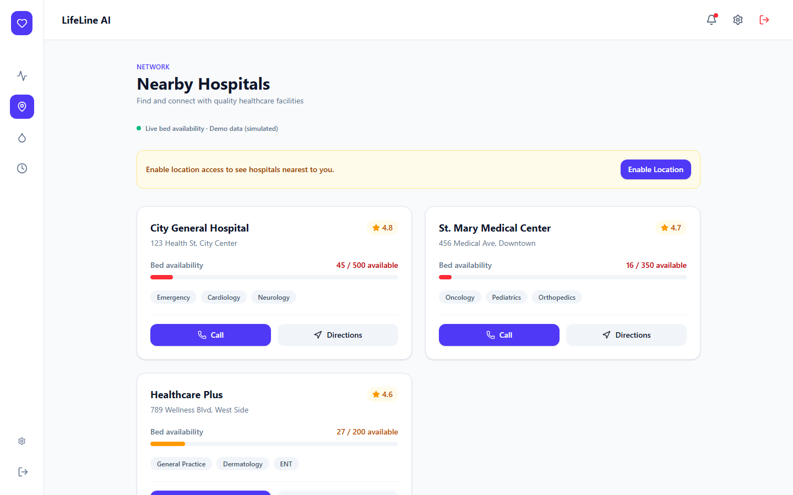
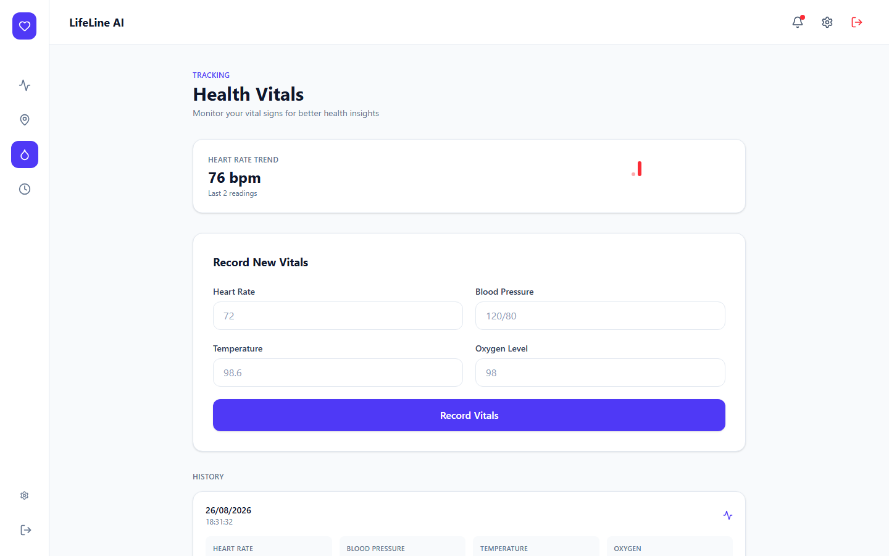
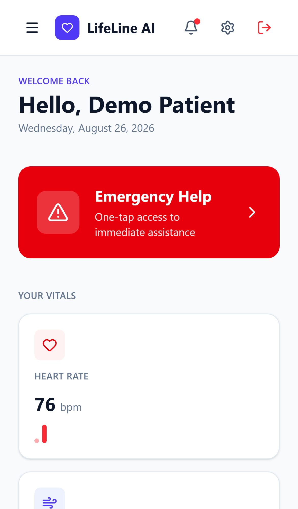

# LifeLine AI

A healthcare dashboard for tracking vitals, finding nearby hospitals, booking appointments, and triggering emergency assistance - built with React 19, TypeScript, and an Express API secured with JWT auth.

[](https://github.com/aayush-arya/lifeline-ai/actions/workflows/ci.yml)
[](LICENSE)



## Live demo

**[Add your deployed URL here after following the deployment guide below]**

Sign in with the seeded demo account, or skip the form and continue as a guest:

| | |
|---|---|
| Email | `demo@lifeline.ai` |
| Password | `demo1234` |

## Features

- **Dashboard** - vitals at a glance, a heart-rate trend chart, quick actions, recent activity
- **Emergency SOS** - one tap dispatches an alert with the user's live geolocation, with a graceful fallback when location is unavailable
- **Hospital finder** - nearby hospitals via the Google Places API when configured, with distance sorted mock data as an automatic fallback; live bed-occupancy simulation
- **Vitals tracking** - record heart rate, blood pressure, temperature, and oxygen level, with history and trend visualization
- **Appointments** - book and track appointments against real hospitals
- **JWT authentication** - bcrypt-hashed passwords, per-user route authorization (one account's token can't read or write another account's data)
- **Fully responsive** - desktop sidebar nav collapses to a mobile drawer

|  |  |
|---|---|
|  |  |
|  |  |

## Tech stack

**Frontend** - React 19, TypeScript, React Router 7, Tailwind CSS v4, Vite, Axios, Vitest + React Testing Library

**Backend** - Node.js, Express 5, JWT (`jsonwebtoken`), `bcryptjs`, Node's built-in test runner + Supertest

**Data** - an in-memory store, seeded on boot. There's no database to provision, so the app runs with zero configuration; see [Data layer](#data-layer) below if you want to swap in a real one.

## Architecture

```
frontend/src/
  pages/           route-level screens (Dashboard, Hospitals, Vitals, Appointments, Profile, Login)
  components/
    layout/        AppShell, Sidebar, Header, MobileNav
    dashboard/      MetricCard, ActionButton
    ui/            Button, Card, Modal, Toast, TextField, Badge, Sparkline
  lib/              geolocation helper, the shared router-outlet context type
  api.ts            typed Axios client + auth-token interceptor

backend/
  server.js         app wiring only - middleware, routes, the bed-simulation interval
  src/
    routes/         one file per resource, mounted under /api
    controllers/     request handlers
    middleware/      requireAuth / requireOwnUser (JWT verification + per-user authorization)
    services/        geo distance, bed-occupancy simulation, Google Places client
    data/store.js    the in-memory data store + seed data
```

Both sides moved from a single monolithic file (one 1,080-line `App.tsx`, one 442-line `server.js`) to this structure; behavior is unchanged, just organized.

## Getting started

**Prerequisites:** Node.js 18+

```bash
npm run install-all   # installs root, backend, and frontend dependencies
npm start             # runs backend (:5000) and frontend (:3000) together
```

Or run them separately in two terminals:

```bash
cd backend && npm install && npm start   # http://localhost:5000
cd frontend && npm install && npm run dev  # http://localhost:3000
```

### Docker Compose

```bash
JWT_SECRET=$(openssl rand -hex 32) docker-compose up
```

`JWT_SECRET` is required for the compose file (see [Environment variables](#environment-variables)) - running `npm start`/`npm run dev` directly doesn't need it, since the backend falls back to an insecure development default with a startup warning.

## Environment variables

Copy `backend/.env.example` to `backend/.env` and fill in what you need - every var is optional for local dev:

| Variable | Purpose |
|---|---|
| `PORT` | API server port. Defaults to `5000`. |
| `JWT_SECRET` | Signs auth tokens. Falls back to an insecure dev default (with a console warning) if unset - set a real value before deploying. |
| `GOOGLE_MAPS_API_KEY` | Enables real nearby-hospital search via Google Places. Without it, `/api/hospitals/nearby` falls back to bundled mock hospitals sorted by real distance. |

The frontend reads `VITE_API_URL` (see `frontend/vercel.json` / your deployment config) to know where the API lives; it defaults to `http://localhost:5000/api`.

## Testing

```bash
cd backend && npm test    # Node's built-in test runner + Supertest
cd frontend && npm test   # Vitest + React Testing Library
```

Both suites also run in CI on every push and pull request (see the badge above).

## API reference

All routes are prefixed with `/api`. Routes marked 🔒 require `Authorization: Bearer <token>` and only allow a caller to access their own `:userId`/`:id`.

| Method | Route | |
|---|---|---|
| POST | `/auth/register` | |
| POST | `/auth/login` | |
| POST | `/auth/guest` | |
| PUT | `/users/:id` | 🔒 |
| GET | `/hospitals` | |
| GET | `/hospitals/nearby?lat=&lng=` | |
| POST | `/hospitals` | |
| POST | `/vitals` | 🔒 (owner derived from the token, not the request body) |
| GET | `/vitals/:userId` | 🔒 |
| POST | `/appointments` | 🔒 (owner derived from the token) |
| GET | `/appointments/:userId` | 🔒 |
| GET | `/dashboard/:userId` | 🔒 |
| GET | `/patients`, `/patients/:id`, POST `/patients` | |

## Data layer

Everything lives in `backend/src/data/store.js` as plain in-memory objects, seeded with a demo user, a demo patient, one vitals record, and three hospitals. That's a deliberate choice for a project meant to be cloned and run instantly - there's nothing to provision. To point it at a real database instead, replace the reads/writes in `src/controllers/*.js` with calls to your persistence layer of choice; the entity shapes are already documented via the seed data and `frontend/src/types.ts`.

## Deployment

See [DEPLOYMENT.md](DEPLOYMENT.md) for step-by-step guides (Render for the backend, Vercel for the frontend). In short:

```bash
cd frontend && npm run build   # static output in frontend/dist
cd backend && npm start        # set PORT, JWT_SECRET, and optionally GOOGLE_MAPS_API_KEY
```

## License

[MIT](LICENSE)
